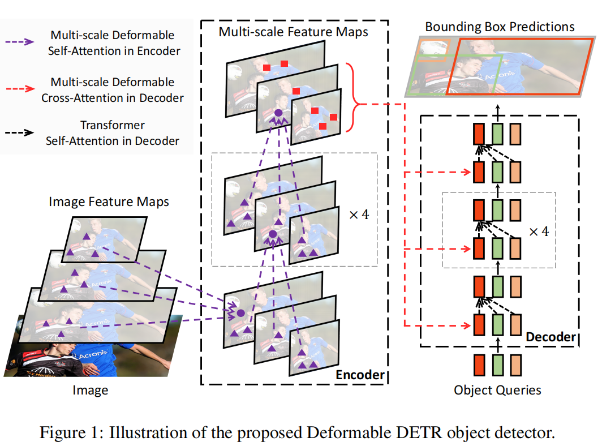
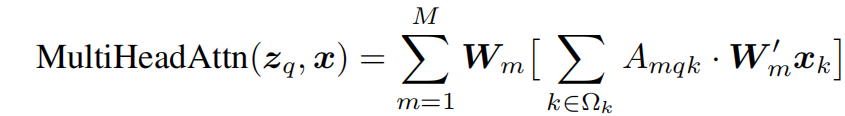
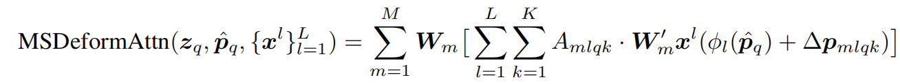
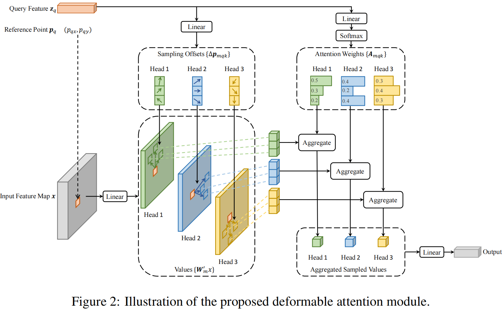

# Deformable DETR


> DETR has its own issues: (1) It requires much longer training epochs to converge than the existing object detectors. For example, on the COCO (Lin et al., 2014) benchmark, DETR needs 500 epochs to converge, which is around 10 to 20 times slower than Faster R-CNN (Ren et al., 2015). (2) DETR delivers relatively low performance at detecting small objects.

DETR**训练效率低~1~**并且**处理不了高分辨率图片~2~**，还有**小目标检测效果不好~3~**。DeformableDETR解决了前两个问题，改善了第三个问题。接下来具体看看是如何解决的。


> we propose Deformable DETR, which mitigates the slow convergence and high complexity issues of DETR. It combines the best of the sparse spatial sampling of deformable convolution, and the relation modeling capability of Transformers. We propose the deformable attention module, which attends to a small set of sampling locations as a pre-filter for prominent key elements out of all the feature map pixels.
>
> 

DETR中backbone一般用的是**CNN来提取特征**的，还没有用到ViT。同样，在Deformable DETR中，并没有改动backbone，而是改了transfomer Encoder和Decoder。


## 补充DETR内容：

DETR 的主干流程：

**图像 → CNN backbone → feature map → Transformer Encoder → Transformer Decoder → 分类头和框回归头**

更具体一点：

- 输入图像 (x)
- 用 CNN 提取特征，得到二维特征图
- 把二维特征图展平成一串 token （要加入位置编码）
- 送入 Transformer Encoder 做全局建模
- 再送入 Transformer Decoder，与一组可学习的 **object queries** 交互
- Decoder 的每个 query 输出一个候选目标
- 最后每个 query 各自预测：
  - 一个类别
  - 一个边界框


Encoder 输入是一串图像 token：
$$
X = [x_1, x_2, \dots, x_{HW}] \in \mathbb{R}^{HW \times d}
$$
每个X~i~ 代表一个pixel

举个直觉例子。

假设图中有一只猫，猫头在一个位置，猫身在另一个位置，沙发在远处。

对于“猫头”位置，Encoder 的 self-attention 可能会关注：

- 猫耳朵位置
- 猫身体位置
- 猫尾巴位置
- 背景位置较少

于是编码后，这个位置很可能属于一整只猫的一部分

这对检测非常重要，因为检测需要的是 **对象级表示**，不是单点局部纹理。

输出：

$$
E = [e_1, e_2, \dots, e_{HW}] \in \mathbb{R}^{HW \times d}
$$
它和输入长度一样，但每个位置的特征已经变成了**融合了全局上下文的图像记忆（memory）**这个 memory 会传给 Decoder。


Decoder 有两个主要输入：

$$
E \in \mathbb{R}^{HW \times d}
$$

$$
Q^{obj} = [q_1^{obj}, q_2^{obj}, \dots, q_N^{obj}] \in \mathbb{R}^{N \times d}
$$

这里 (N) 是固定的，比如 100。

这些 object queries 是 **可学习参数**，不是从图像里算出来的。

object queries 不是某个具体物体类别的模板，也不是某个空间位置的 anchor。它更像一个抽象的“候选目标指针”。

每层 Decoder 有三步：

(1) query 之间先做 self-attention

(2) query 再和 Encoder memory 做 cross-attention

(3) 再经过 FFN（两层MLP）

最终 Decoder 输出：
$$
Y^{(L)} = [y_1^{(L)}, y_2^{(L)}, \dots, y_N^{(L)}]
$$
每个 $(y_i^{(L)} \in \mathbb{R}^d) $都对应一个 query 的最终表示。

然后对每个 query，接两个预测头：

1. 分类头: $\hat{c}_i = \mathrm{Linear}(y_i^{(L)})$  这里类别里还包括一个特殊类：$\varnothing$表示 **no object**。

2. 边框回归头: $\hat{b}_i = \mathrm{MLP}(y_i^{(L)})$一般表示为：$\hat{b}_i = (c_x, c_y, w, h)$
   


接下来先说deformable的机制：



这个是多头注意力机制的特征处理的数学表达（**Multi-Head Attention in Transformers.**）

在标准 attention 里，一个 query 要和所有 key 做相关性计算：$\mathrm{Attention}(Q, K, V) = \mathrm{softmax}\left(\frac{QK^\top}{\sqrt{d}}\right)V$

如果把一张特征图拉平成 N 个 token，那么每个 query 都要看全部 N 个位置。所以复杂度接近$O(N^2)$对于检测任务，尤其高分辨率图像，N 很大，这就很慢。


deformable attention 的核心思想是**没必要让每个 query 看整张图。**

对于一个 query，我们只让它看：一个 **reference point**（参考点）,这个点附近的 **少量采样点**,在这些采样点上取特征并加权求和



这个是多尺度可变形注意力机制的特征处理的数学表达。（**Multi-scale Deformable Attention Module**.）

参数介绍：

$\mathbf{W}'_m, \mathbf{W}_m$ 是线性变换矩阵。$\mathbf{W}'_m$对第 (m) 个 head 取到的特征做投影  $\mathbf{W}_m$把各 head 的结果映射回输出空间，本质上跟 multi-head attention 里每个 head 的线性变换很像。

 ${\mathbf{x}^l}_{l=1}^{L}$ 表示多尺度输入特征集合

$\hat{\mathbf{p}}_q \in [0,1]^2$这是归一化 reference point

$\phi_l(\hat{\mathbf{p}}_q)$ 它的作用是把统一归一化坐标 $\hat{\mathbf{p}}_q$映射到第 (l) 个特征层的坐标系上。因为不同尺度的 feature map 大小不同，所以同一个归一化点 (x,y)，在不同层上对应的位置不同。

$\Delta \mathbf{p}_{mlqk}$ 在第m个 head、第 l个尺度上，第q个 query 的第 k 个采样偏移。所以每个 query 在每个 head、每个尺度上都有 (K) 个采样点。

$A_{mlqk}$  这是每个尺度、每个采样点对应的权重。它满足归一化：$\sum_{l=1}^{L}\sum_{k=1}^{K} A_{mlqk} = 1$


如果把多尺度去掉，defomable attention的结构图如下。

> 


小目标检测：

多尺度就是对每个 query，在每个 attention head 上，到每个尺度的特征图中，围绕 reference point 找 (K) 个采样位置；从这些位置插值（==双线性插值==）取特征；再用学习到的权重做加权求和；最后汇总所有 head 的结果。

也就是：
$$
\text{输出}

\sum_{\text{head}}
\sum_{\text{level}}
\sum_{\text{point}}
\text{weight}
\times
\text{sampled feature}
$$
检测里不同目标尺度差异很大，小目标更依赖高分辨率特征层，大目标更依赖低分辨率、强语义层。

如果只在单尺度上做 deformable attention，会有小目标信息不够，语义和细节难兼顾。

所以 multi-scale deformable attention 相当于让每个 query 自己学会，去哪个尺度看，在该尺度上看哪些位置，每个位置看多少权重。

补充：每个尺度的特征图是由backbone卷积层下采样过程中得到。


复杂度下降：

假设总 token 数为 N。

普通 attention：$O(N^2)$

multi-scale deformable attention：

如果每个 query 每个 head 只看 $L \times K$个点，那么复杂度近似：$O(N \cdot M \cdot L \cdot K)$

其中：M 头数,L 层数,K 每层采样点数

因为 L 和 K 都很小，所以远小于全局 attention。


细节与有趣的地方：

1.encoder中reference point是固定的，学习的有偏移量和注意力矩阵


2.decoder中reference point，和offset都是学习的。所以很神奇的是decoder中reference point是可学习的，这导致注意力可能聚焦在更每张图片特征最明显的地方，而不是固定的。


3.为什么要用双线性插值法（bilinear sampling ）

因为采样位置通常不是整数坐标。(12.3,18.7)。它不正好落在某个格点上，所以要用双线性插值从周围四个格点估计特征值。

这使得采样位置可以是==连续==的，offset 可以端到端学习，整个模块==可微==，若没有双线性插值，offset，reference point都离散（若就近取整则导数一般都为0）。这也是 deformable attention 能训练起来的关键。

假设采样点是(x,y)=(12.3,18.7)，它落在四个点之间：

```
(12,18) ---- (13,18)
   |            |
   |   ●        |
   |            |
(12,19) ---- (13,19)
```


