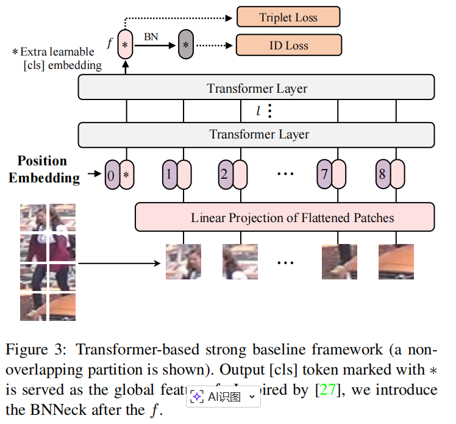
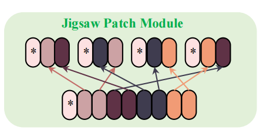
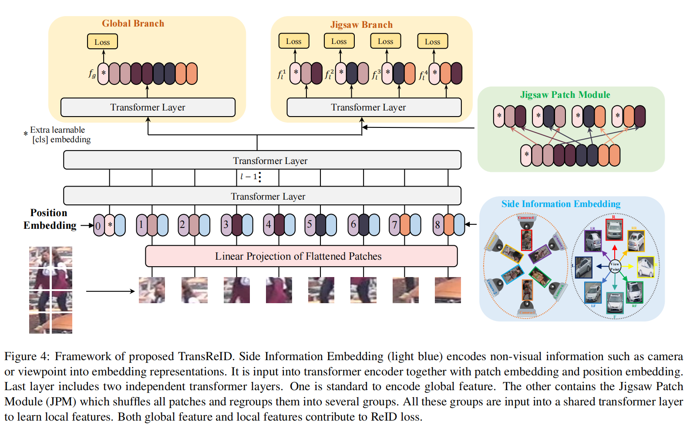

# TransReID

> The JPM is employed on the last layer of the model to extract robust features in parallel with the global branch which does not include this special operation. Hence, the network tends to extract perturbation invariant and robust features with global context.



> An extra learnable [cls] embedding token denoted as \( x_{\text{cls}} \) is prepended to the input sequences. The output [cls] token serves as a global feature representation \( f \). Spatial information is incorporated by adding learnable position embeddings. Then, the input sequences fed into transformer layers can be expressed as:
>
> $$
> Z_0 = [x_{\text{cls}}; F(x^1_p); F(x^2_p); \dots; F(x^N_p)] + P
> $$

模型分为全局分支和局部分支。局部分支由JPM提供，在下文进行讲述，重点放到全局分支（源自ViT，其实就是vison transformer中的特征提取方式）。

==x~cls~==是一个**可学习的类别标记向量**(在模型初始化时随机生成)，在输入序列前拼接，作为 Transformer 的第一个 token。它的作用是在自注意力过程中聚合全局信息，最终输出作为==全局特征==。

**初始输入**： 
$$
Z_0 = [x_{\text{cls}}; F(x^1_p); \dots; F(x^N_p)] + P
$$

其中 \( F \) 是将图像块投影到嵌入维度的线性层，\( P \) 是位置编码。 

- **逐层更新**： 
  在每一层 Transformer 中，`x_cls` 与所有 patch embeddings 通过自注意力相互交互，共同更新。`x_cls` 借助对全图 patch 的注意力汇聚全局信息，同时自身也参与信息的传递。
- **最终输出**： 
  经过 \( L \) 层后，提取 `x_cls` 位置的输出作为整张图像的**全局特征表示** \( f \)。

剩下的image patch产出的局部特征还有用，会在JPM中使用到。（在ViT中局部特征后续并没有用处了。）


>  *L~ID~* is the cross-entropy loss without label smoothing. For a triplet set *{**a, p, n**}*, the triplet loss *L~T~* with soft-margin is shown as follows:
> $\mathcal{L}_T = \log \left[ 1 + \exp \left( \|f_a - f_p\|_2^2 - \|f_a - f_n\|_2^2 \right) \right]$

其中L~ID~损失论文中没有介绍。这是因为它是ReID任务中最基础的内容。$L_{ID} = -\log p_y$  其中p~y~是正确答案的概率。

模型不会直接输出概率，它输出的是一个向量里面的数字是打分：$\mathbf{z} = [z_1, z_2, ..., z_N]$

完整公式（其中利用softmax形式变成概率）：


$$
L_{ID} = -\log \frac{e^{z_y}}{\sum_{j=1}^{N} e^{z_j}}
$$
其中triplet损失是transReID提出的将答案和正负样本的embedding显式的用用欧式距离来改变,优化了embedding空间结构。


> Overlapping Patches.
>
> Pure transformer-based models(e.g. ViT, DeiT) split the images into non-overlapping patches, losing local neighboring structures around the patches. Instead, we use a sliding window to generate patches with overlapping pixels. Denoting the step size as S*S*, size of the patch as P*P* (e.g. 16), then the shape of the area where two adjacent patches overlap is (P−S)×P. An input image with a resolution H×W will be split into *N* patches.
>
> $N = N_H \times N_W = \left\lfloor \frac{H + S - P}{S} \right\rfloor \times \left\lfloor \frac{W + S - P}{S} \right\rfloor$

该部分提出使用**重叠的图像块**来替代传统 Vision Transformer（如 ViT、DeiT）中的非重叠分块方式，目的是保留相邻图像块之间的局部邻域结构，避免信息丢失。


> we propose a jigsaw patch module (JPM) to shuffle the patch embeddings and then re-group them into different parts, each of which contains several random patch embeddings of an entire image. In addition, extra perturbation introduced in training also helps improve the robustness of object ReID model. Inspired by ShuffleNet [53], the patch embeddings are shuffled via a shift operation and a patch shuffle operation.
>
> 
>
> As shown in Figure 4, paralleling with the jigsaw patch, another global branch which is a standard transformer encodes  $Z_{l-1}$ into$Z_l = [f_g;\ z_l^1,\ z_l^2,\ ..., z_l^N]$,
> where f~g~ is served as the global feature of CNN-based methods. Finally, the global feature \(f_g\) and \(k\) local features are trained with $L_{ID}$and $L_T$. The overall loss is computed as follows:
> $$
> L = L_{ID}(f_g) + L_T(f_g) + \frac{1}{k} \sum_{j=1}^{k} \left( L_{ID}(f_j^l) + L_T(f_j^l) \right).
> $$
> 

JPM模块就是将上文提到的image patch打乱$[z^{\,l-1}_{x_1}, z^{\,l-1}_{x_2}, \ldots, z^{\,l-1}_{x_N}], \quad x_i \in [1,N]$  ,再分组$[{G_1, G_2, \dots, G_k}]$  ,使每组特征都有近乎全局的特征。

$\frac{1}{k}\sum_{j=1}^k \big(L_{ID}(f_j^l) + L_T(f_j^l)\big)$ ,故JPM部分的损失函数应该这样写。


> Instead of the special and complex designs in CNN-based methods for utilizing these non-visual clues, we propose a unified framework that effectively incorporates non-visual clues through learnable embeddings to alleviate the data bias brought by cameras or viewpoints. Taking cameras for example, the proposed SIE helps address the vast pairwise similarity discrepancy between inter-camera and intra camera matching (see Figure 6). SIE can also be easily extended to include any non-visual clues other than the ones we have demonstrated.

Side Information Embeddings (SIE) 的“自动更新”机制，是通过将其作为**可训练参数**融入Transformer的输入端，并利用**端到端的反向传播**来实现的。整个过程无需人工干预，模型会自行学习如何利用相机ID、视角等非视觉信息来优化最终的特征表达。

```
输入序列 = [cls] + Patch_Embeddings + Position_Embeddings + SIE_Embeddings
```

这里的SIE_Embeddings就是根据每张图像的相机ID或视角信息。

==SIE并不是一个监督学习的板块==，但它是可训练参数。当视角或相机带来的差异与影响时，反向传播有两种调整方案，1是调整视觉特征embedding,2是调整SIE embedding。如果存在SIE embedding的话，那调整SIE embedding会成为模型的最优解。这使得模型对人物识别学会忽略摄像头或视角带来的影响。所以这就是SIE如何在模型上有作用。

这些SIE向量并非孤立存在，而是直接与图像块的特征向量相加，共同输入到Transformer编码器中。这样一来，模型在每一层计算自注意力时，都会被明确告知：“这张图来自摄像头A，视角是B”。

- **对于相机ID**：不同的摄像头有不同的光照、角度等特性，SIE可以帮助模型学习到这些特性，并在特征提取时将其==“减去”==，从而关注于身份本身的不变特征。
- **对于视角**：对于车辆ReID等任务，视角信息同样重要。SIE通过编码视角，使模型对朝向变化更具鲁棒性。

通过这种端到端的学习，SIE的参数会被优化成一种“偏置项”。理想情况下，模型最终会学到：

- **分离偏差**：来自不同相机的同一物体，在特征空间中原本可能因为光照等原因相距很远。SIE的引入，相当于教会模型去补偿这种相机带来的差异，使得**经过SIE修正后的特征，更聚焦于物体本身的身份特征**。
- **统一表示**：最终输出的特征，已经剥离了相机和视角带来的影响，因此在做特征比对时更加准确。

**总结一下**：SIE的自动更新，本质上是将非视觉信息转化为可训练的向量，将其作为额外的输入特征，让模型在**优化ReID目标（让同类近、异类远）的过程中，通过梯度回传来反向调整这些向量的数值**，最终使它们学会如何帮助模型“忽略”相机视角的影响，提取出更鲁棒的身份特征。


以上是transReID大部分思想和内容，其中我认为最有意思的是SIE,感觉是用一种隐式的方式去消除相机和视角的因素。


