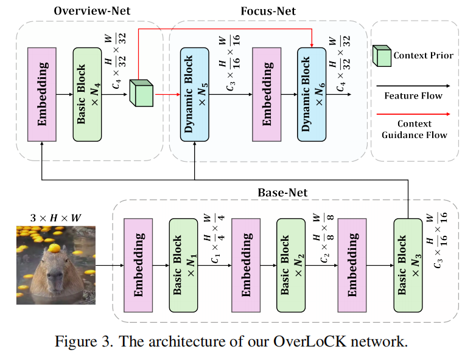
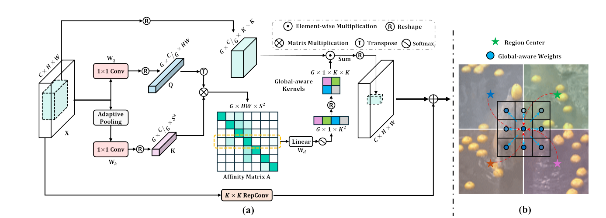

# OverLock

> 视觉感知现在有很多关于top-down attention的方案。但是他们都存在一定的问题，就是中间层没有一个明确的语义指导。
>
> overlock的提出就是解决这个问题，让这个top-down attention有一个全程的语义指导。

**1.即在后半程注入上下文先验。（Deep-stage Decomposition Strategy）**

> 如何在保持局部归纳偏置（inductive biases）的同时,让纯卷积网络具有全局的建模能力是一个问题。

**2.上下文动态卷积核（ContextMixing Dynamic Convolution）**

和注意力机制很相似。