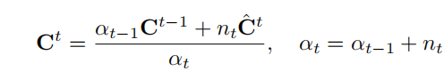
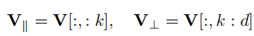
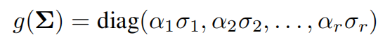
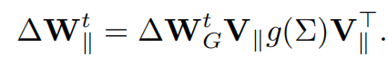

# SAME: Stabilized Mixture-of-Experts for Multimodal Continual Instruction Tuning

## 1.为什么提出？

> Such failure reflects two problems: router *drift*, where expert selection becomes inconsistent over time, and *expert drift*, where shared experts are overwritten across tasks.

路由漂移和专家漂移问题。一个是路由的mlp把一些旧任务路由错误到了其他地方。一个是专家本身的知识被改变。

## 2.分析

从多模态大模型（MLLM）的发展出发，在一些真实场景能力不完善。所以需要提高持续学习的能力，即在多模态持续指令微调（MCIT）过程中需要抑制灾难性遗忘。而灾难性遗忘是怎么造成的呢？在这个论文中就是由于路由漂移和专家漂移。

## 3.方案

> StAbilized Mixture-of-Experts (SAME) for scalable continual instruction tuning.

> .SAME mitigates **router drift** via **spectral-aware routing** that updates routing weights in task-relevant subspaces.To control **expert drift**, we apply **curvature-aware** Riemannian scaling to preserve prior expert behaviors.

### 3.1   **Spectral-aware Routing**

进入 MoE router 之前的 Transformer 隐藏层特征 xxx，用协方差的方法进行统计，形成一个协方差分布。通过这个协方差分布可以看出特征的变化，知道哪些方向是重要的。感觉是一种经验累积的结果。

这导致了一个问题，全部记录这个协方差的内存消耗成本太高。
故对这个协方差矩阵**进行SVD分解**，选出前k个“能量”的区域进行存储，确保了我们能够捕捉梯度缩放过程中最重要的方向。

并将原始梯度**投影到由 V∥（当前任务重要方向）** 所捕捉的新任务关键方向上。

并利用奇异值来加权。

