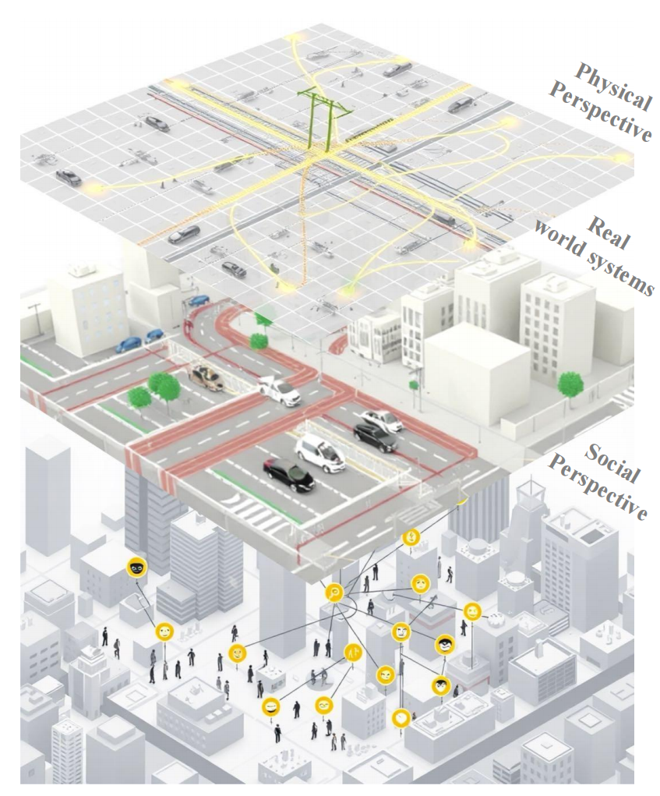
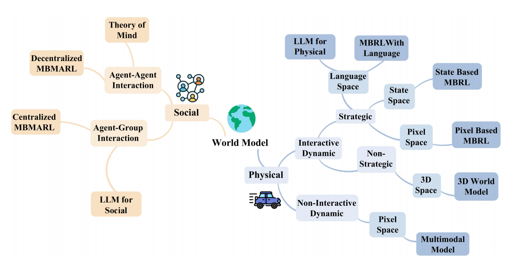
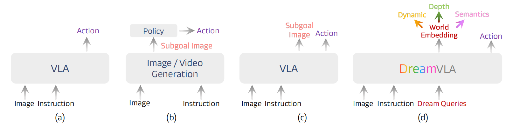
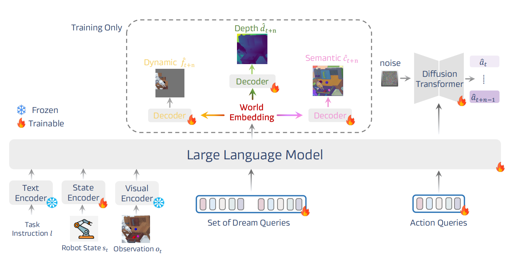
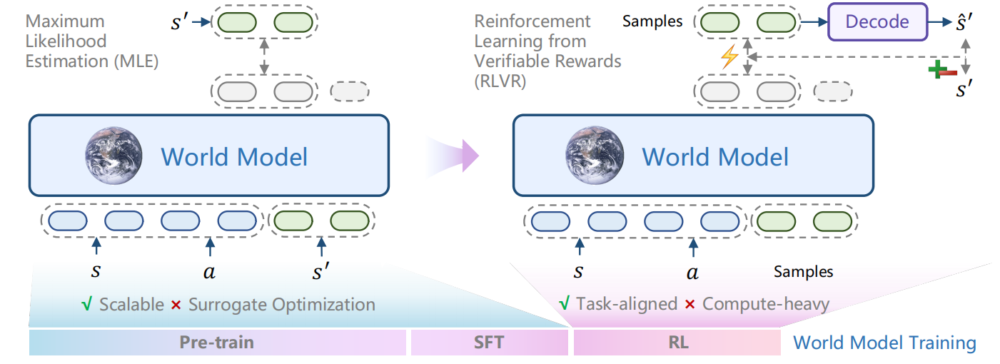

# Note

## 25年NeurIPS:

### World Models Should Prioritize the Unification of Physical and Social 

> ​	当前 World Model 大多分别研究物理动力学或社会行为：前者擅长预测物体、环境和机器人状态，却往往忽略意图、信念、关系和社会规范；后者能够模拟人物行为和多智能体互动，却常缺乏真实物理环境约束。本文认为这种割裂限制了长期预测、因果推理和多智能体决策，因此提出 **ACE Principles**，要求模型处理社会抽象、情境依赖因果以及物理—社会共同演化，并给出 \(WM_{P-S}\) 概念框架，将物理状态与社会状态统一到联合状态转移中。**论文没有训练具体模型，也没有定量实验，其贡献主要是重新定义下一代 World Model 应建模的对象和研究路线。**
>
> Physical-Social State World Model → Bidirectionally Coupled Dynamics → Joint Physical & Social State Prediction → Planning / Simulation / Multi-Agent Decision Making
>
> 
>
> 

### DreamVLA: A Vision-Language-Action Model Dreamed with Comprehensive World Knowledge

> 现有 VLA 通常直接从视觉和语言预测动作，而引入 world prediction 的方法又常预测完整未来 RGB 图像，既**包含大量无关背景，又缺少显式空间与语义结构**。DreamVLA 因此提出 **Comprehensive World Knowledge Forecasting**：不重建整张未来图像，而预测未来动态区域、深度几何和高层语义，并通过结构化 attention 防止不同知识相互污染，再使用 Diffusion Transformer 根据未来 world embedding 生成动作。实验中其 CALVIN ABC-D 平均连续完成任务数达到 **4.44**，LIBERO 平均成功率 **92.6%**，真实 Franka 机器人平均成功率 **76.7%**，说明“预测任务相关世界知识”比完整像素预测更适合机器人控制。
>
> **是否 Action-conditioned：** **No**
> 通过instruction，和图像，机器人物理状态的输入，直接预测未来动态区域、深度几何和高层语义这三个部分，这三个部分构成w(diffusion的输入)**未来世界的表示**，w经过diffusion transformer(Decoder)直接得到动作预测a
>
> VLA之前有直接预测动作的，有显式预测未来的（预测出未来图像），而现在是预测出w，未来世界的latent表示，通过这个解码出动作。
>
> 
>
> 

### WorldModelBench: Judging Video Generation Models As World Models

> 传统视频生成 Benchmark 主要评价清晰度、时序一致性和文本匹配，但“视频看起来真实”并不意味着模型真的理解世界动力学。WorldModelBench 因此构建 **350 个 image-text 条件、7 个应用领域、56 个子领域**，从 Instruction Following、Commonsense 和 Physics Adherence 三方面评价生成的未来视频，并收集约 **67K 人类标签**监督自动 Judger。实验表明，当前顶级视频模型仍频繁出现质量不守恒、物体穿透和任务执行失败；同时，通用视频质量指标与物理正确性的相关性很弱。论文进一步证明 Judger 的奖励能够反向用于改善视频生成模型。
>
> 视频生成模型到底算不算是worldmodel？提出了一个判断方案。  不仅看视频生成质量，还要看其符不符合物理定律
> WorldModelBench还可以成为ReWardModel,帮助模型进行后训练

### RLVR-World: Training World Models with Reinforcement Learning

> 传统世界模型通常依赖大规模视频数据进行监督学习，通过最大似然目标学习环境动态。然而，这类方法容易产生视觉合理但物理错误的预测，例如物体运动不符合动力学规律、长期状态演化不稳定等。RLVR-World 认为世界模型训练不应局限于被动模仿数据，而应像强化学习中的智能体一样，通过环境反馈不断优化。
>
> 该工作提出将 **Reinforcement Learning with Verifiable Rewards（RLVR）** 引入世界模型训练，通过设计可验证奖励函数，对生成视频中的物理一致性、状态变化合理性以及未来预测质量进行评价，并利用强化学习优化生成模型参数。实验表明，RLVR-World 能够提升世界模型在长时间视频预测、物理规律保持以及交互式模拟任务中的表现，证明强化学习可以成为训练下一代世界模型的重要范式。
>
> 
>
> 提出用RL进行post-training的范式。（针对不同任务进行后训练，可以设计不同的奖励函数）
>
> 因为之前的训练指标和实际应用的指标不一致，世界模型不只是要把世界的分布构建好，还需要为其实际应用做一些准备。
>
> 在language和video WM上做了实验
>
> 局限性：
>
> 虽然带来了显著提升，但训练通常仅在数百步内收敛
>
> 引入物理规则和时间一致性等约束条件，则需要更精细的奖励设计

