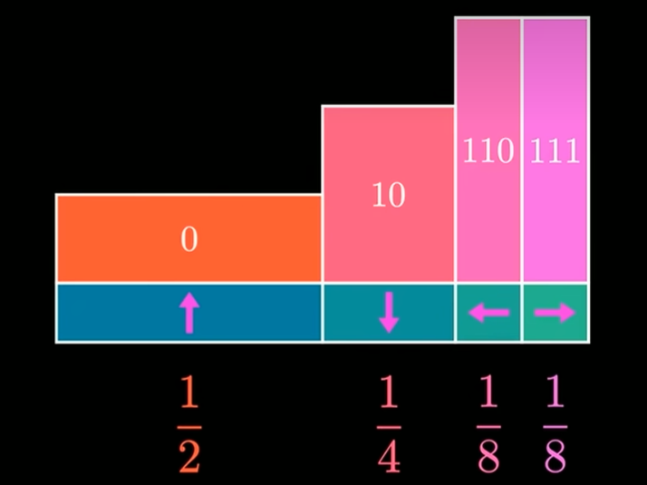
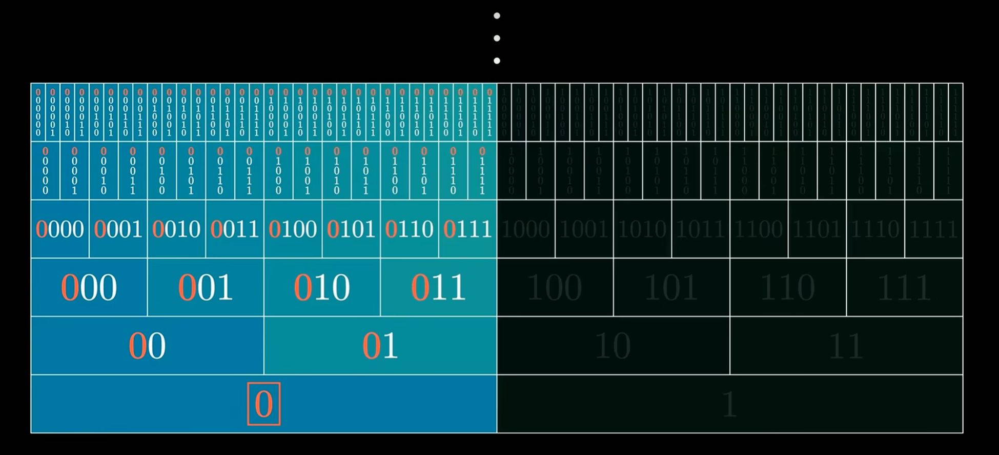
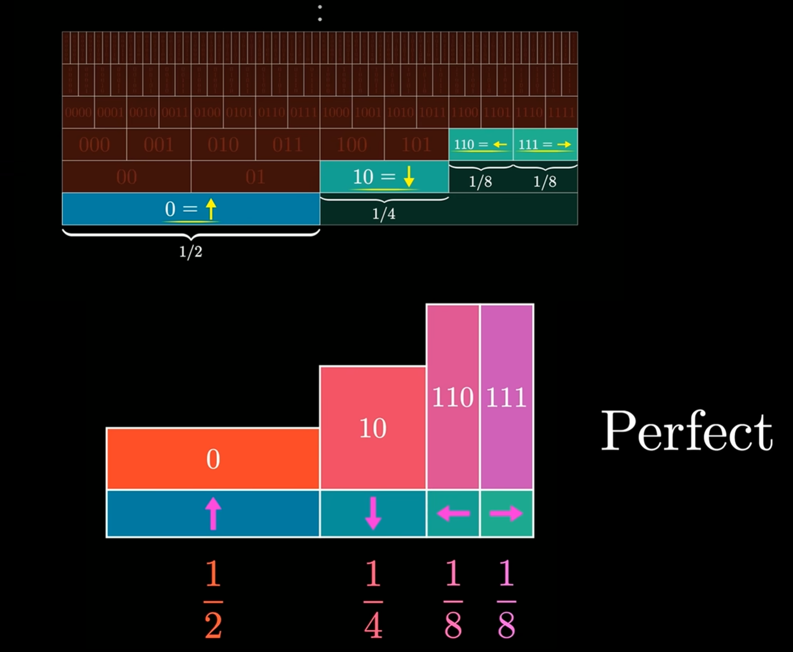
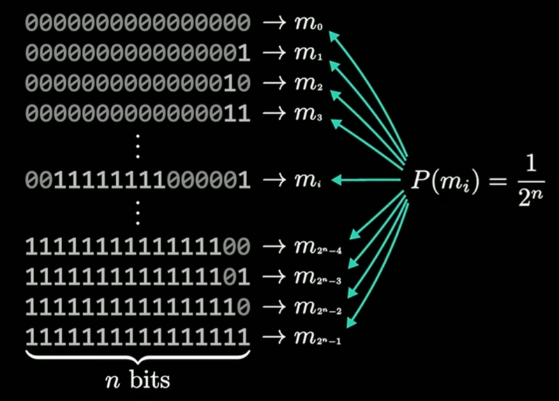
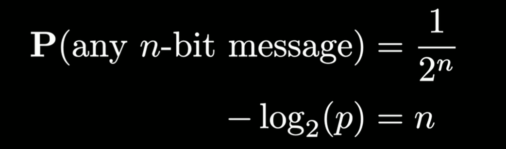
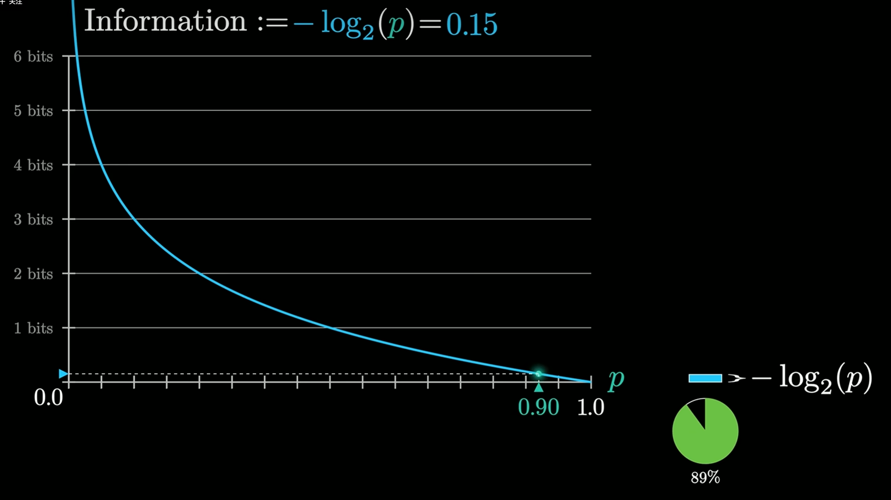
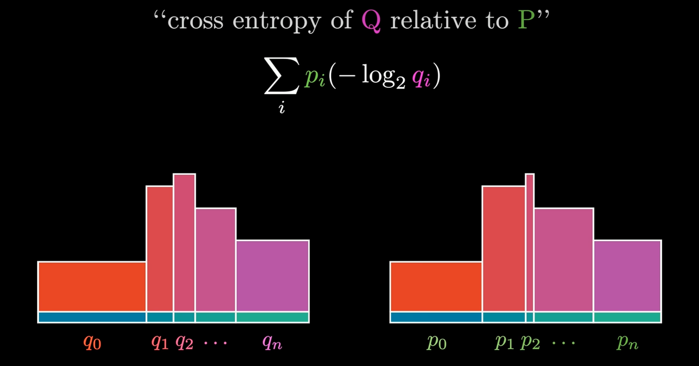
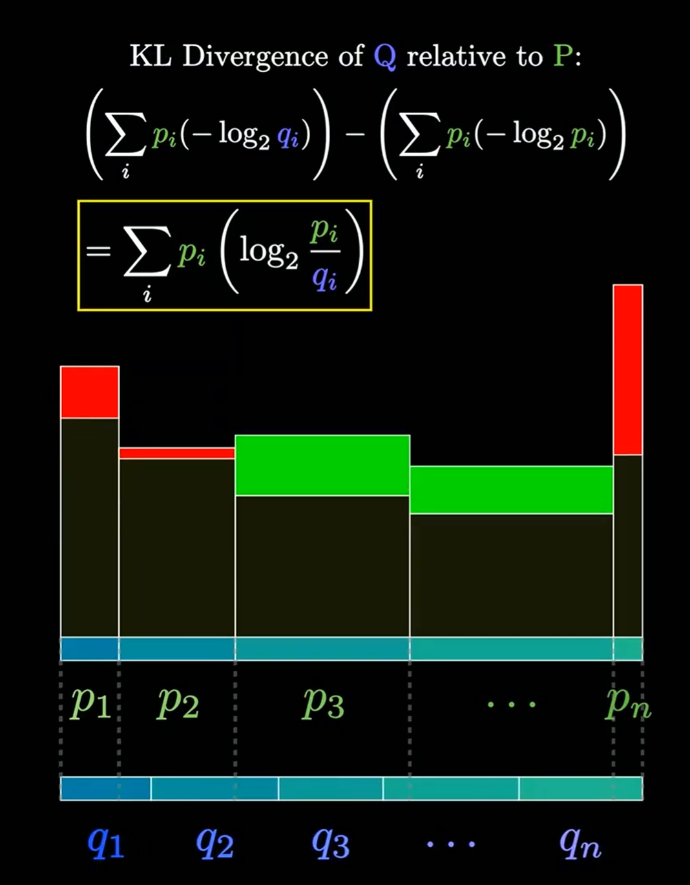

# 压缩，熵与交叉熵

【【官方双语】压缩即智能：Part1，重新发明熵】 https://www.bilibili.com/video/BV1yVNU6xERx/?share_source=copy_web&vd_source=ced11768c7fcb9167c1df72180e4510d

【交叉熵到底是什么？| 压缩即智能 第二部 - 3Blue1Brown】 https://www.bilibili.com/video/BV1CNKj6vEyT/?p=2&share_source=copy_web&vd_source=ced11768c7fcb9167c1df72180e4510d

考虑四个符号用字符编码进行表示。

前缀码表示的方法。

这种表示方法像是一种完美的压缩（刚好占用了所有的可能性）

得到信息和概率关系的推论。  概率越高信息越少

进入正题，交叉熵

**将一种分布规律放到另一种分布中得到的信息量，当q等于p的时候（分布相同），交叉熵最小。**

比如说LLM训练过程，就是训练一种概率分布，用已有的信息推得新的词出现。
而现实中的数据集包含大量的语言，文本等，用交叉熵去训练实际上就是在让LLM所产生的分布与数据集相同。

而所谓的KL散度，本质上就是**交叉熵与熵的差值**，也就是分布与分布之间的区分度，散度。
